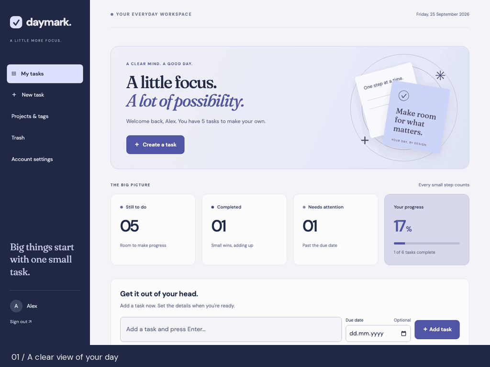

# Daymark · Django Todo App

Daymark is a to-do app built with Django and SQLite. You can use it to keep a
simple daily list or organize tasks into projects, with tags, subtasks, and
recurring due dates. Each account has its own tasks.

The interface uses Django templates, with a little JavaScript for keyboard
shortcuts and installation support. There is no separate frontend build step.
It works on desktop and mobile, and is available in English and Turkish.



The demo uses sample data.

## Run it locally

You'll need Python 3.12–3.14 and pip. From the project directory, run:

```bash
python3 -m venv .venv
source .venv/bin/activate
python -m pip install -r requirements.txt
python manage.py migrate
python manage.py runserver
```

On Windows, activate the environment with `.venv\Scripts\activate` instead.

Open http://127.0.0.1:8000 and create an account. Tasks are stored in the local
`db.sqlite3` file.

For local development, the app generates a signing key on startup. Restarting it
can sign you out and invalidate existing email links. Set `DJANGO_SECRET_KEY` to
your own random secret if you want those to survive restarts. Keep the key out of
Git.

## Using the app

Type a task into the quick-add field and press Enter. You can add a due date
there, or open the editor to add notes, set a priority, and assign a project or
tags. Click the circle beside a task to complete it; you can reopen it later.

Search looks through titles and notes. Filters let you see what's due today,
coming up in the next seven days, overdue, or still missing a date. You can also
filter by project, tag, and priority, and sort by due date or creation date.

A few other things you can do:

- **Break work into smaller steps.** Add subtasks from a task's detail page.
  Checking them off doesn't automatically complete the parent task.
- **Repeat a task.** Choose a daily, weekly, or monthly schedule and a due date.
  Completing it creates the next occurrence from the previous due date. Monthly
  tasks keep their original day where possible: January 31 becomes February 28,
  then March 31.
- **Reuse or postpone a task.** Duplicate it to start with a copy, or move an open
  task to tomorrow or next week.
- **Recover a deleted task.** Deleted tasks go to Trash, where you can restore
  them or confirm permanent deletion.
- **Export your list.** Download active tasks as JSON or CSV. JSON also includes
  projects, tags, recurrence, and subtasks. Exports exclude Trash and include
  tasks outside the current filter. They aren't full database backups, and there
  is no import feature.

On the dashboard, **Alt+Shift+N** jumps to quick add and **Alt+Shift+F** jumps to
search.

## Account settings and email

In **Account settings**, you can choose your language and timezone, change your
password, and update your email address. Dates use UTC by default unless the
server's `DJANGO_TIME_ZONE` setting or your account timezone says otherwise.

Password reset, email verification, and reminders need SMTP configuration on the
server. Reminders are optional: verify your email, enable them, and choose a local
hour. They send a count of tasks due today or overdue, without including task
contents. The [operations guide](docs/operations.md#accounts-and-mail) explains
how to set up email and schedule the reminder job.

You can also install Daymark from a supporting browser using **Install** or
**Add to Home Screen**. You still need a connection to view or change tasks;
offline mode shows a reconnect page.

## Development

Most application code is in `tasks/`:

```text
config/                     Django settings and top-level URLs
tasks/                      Models, forms, views, and application URLs
  templates/tasks/          Page templates
  static/tasks/             Styles, scripts, fonts, and icons
  locale/                   Translations
  migrations/               Database migrations
  management/commands/      Backup, restore-check, and reminder commands
  tests/                    Application tests
deploy/                     Docker Compose, nginx, and scheduled-job examples
docs/                       Setup and maintenance guides
```

See [project layout](docs/project-layout.md) for more detail. The `.venv/`
directory and local database are runtime files and should stay out of Git.

Before submitting a change, run:

```bash
python manage.py check
python manage.py makemigrations --check --dry-run
python manage.py test
```

Tests cover task ownership, account flows, recurring tasks, exports, backups,
and security controls. CI uses a separate database configuration. Contribution
instructions are in [CONTRIBUTING.md](.github/CONTRIBUTING.md).

## Deployment and backups

The repository includes a Dockerfile, a Compose configuration, an nginx example,
and GitHub Actions workflows for testing and deployment. Follow the
[deployment guide](docs/ci-cd.md) to configure your server and repository.

Use `config.settings_production` for deployment. It requires a strong
`DJANGO_SECRET_KEY` and explicit `DJANGO_ALLOWED_HOSTS`, and expects HTTPS through
a trusted reverse proxy. The default settings are for local development.

For database backups, restore checks, off-site storage, and monitoring, see the
[operations guide](docs/operations.md). Read the
[database upgrade notes](docs/database-upgrades.md) before upgrading an existing
installation; migrations also handle older `base_task` records.

## Security and license

To report a security issue privately, follow [SECURITY.md](SECURITY.md).

Daymark is licensed under [Apache 2.0](LICENSE.md). Changes are recorded in the
[changelog](CHANGELOG.md).
